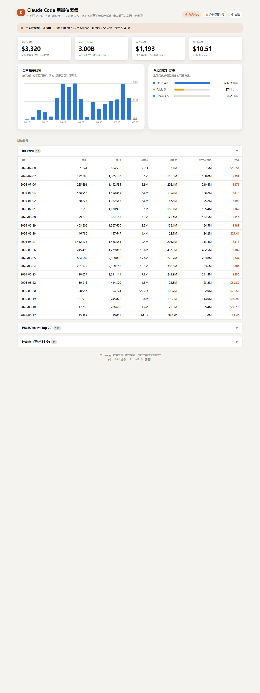
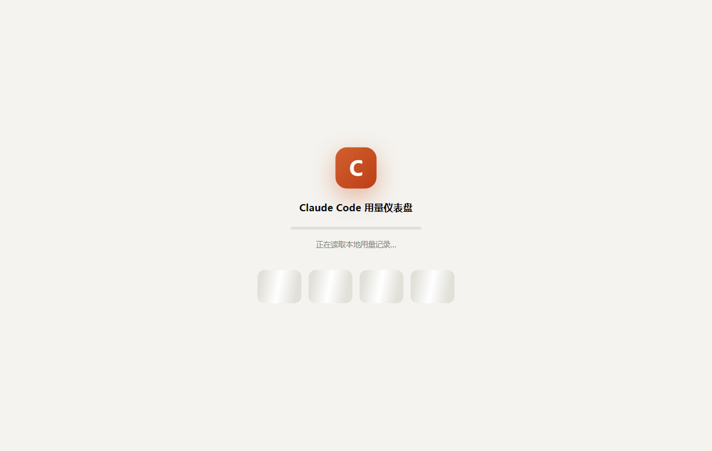

# ccusage-dashboard

> A beautiful, **ephemeral** usage dashboard for Claude Code — one click, no console window, burn-after-read.

Turns [`ccusage`](https://github.com/ryoppippi/ccusage) data into a polished local web dashboard: KPI cards, a daily-cost chart, a per-model breakdown, and detail tables. Click the shortcut → the browser opens **instantly** with a loading animation → your dashboard fades in a few seconds later → the temp files delete themselves.



## Why another usage tool?

- **No binary to install or trust** — it's a tiny HTML + PowerShell tool, not a compiled tray app.
- **Burn-after-read** — the report lives in `%TEMP%` for ~20s, then deletes itself. Only ever one temp file; nothing accumulates.
- **Private** — all data stays on your machine; nothing is uploaded.
- **Instant + animated** — the browser opens immediately with a loader while `ccusage` runs **in parallel** (~5s), then the dashboard fades in.
- **Light / Dark**, responsive, hover tooltips.

<p align="center"></p>

## Requirements

- Windows 10 / 11
- [Node.js](https://nodejs.org) (LTS)
- [`ccusage`](https://github.com/ryoppippi/ccusage) — the installer adds it automatically if missing

## Install

```powershell
git clone https://github.com/YOUR-NAME/ccusage-dashboard.git
cd ccusage-dashboard
# double-click install.bat  — or run:
powershell -ExecutionPolicy Bypass -File install.ps1
```

The installer copies the program to `%LOCALAPPDATA%\ClaudeUsage`, creates a **Desktop shortcut**, and installs `ccusage` if it's missing.

## Use

Double-click **Claude Usage Dashboard** on your Desktop.

**Pin to taskbar:** drag the shortcut onto the taskbar. (Windows 11 removed the right-click *Pin to taskbar* for script shortcuts, so dragging is the way.)

## Customize

Everything lives in `%LOCALAPPDATA%\ClaudeUsage`:

| File | Controls |
|---|---|
| `template.html` | look & feel — layout, colors, charts, copy |
| `Generate-ClaudeReport.ps1` | data collection, parallelism, burn delay |
| `dashboard.vbs` | the silent (no-window) launcher |
| `dashboard.bat` | fallback launcher (shows a console) |
| `icon.ico` | the shortcut icon |

## How it works

1. `dashboard.vbs` (run hidden by `wscript`) starts `Generate-ClaudeReport.ps1`.
2. The script drops a static **shell page** and opens it in your browser immediately → you see the loading animation.
3. It runs `ccusage monthly / daily / session / blocks --json` **in parallel**, then writes `data.js` atomically.
4. The page polls for `data.js`, renders, and fades in.
5. After a short delay both temp files are deleted (the page is already in memory).

## Security note

The launcher is a plain-text `.vbs` that runs PowerShell with a hidden window. It deliberately **avoids** the classic `powershell -WindowStyle Hidden -ExecutionPolicy Bypass` shortcut pattern that antivirus tools flag — no `Bypass`, no hidden flags baked into the shortcut. Every file is readable and auditable. If your AV ever prompts, allow it.

## Uninstall

```powershell
powershell -ExecutionPolicy Bypass -File uninstall.ps1
```

(Node.js and `ccusage` are left installed.)

## Credits

Built on [`ccusage`](https://github.com/ryoppippi/ccusage) by @ryoppippi. Dashboard, launcher and installer by the contributors of this repo.

## License

[MIT](LICENSE)

---

<details>
<summary><b>中文说明</b></summary>

一个给 Claude Code 用的**阅后即焚**用量仪表盘。点击桌面图标 → 浏览器**秒开**加载动画 → 几秒后淡入精美仪表盘 → 临时文件自动焚毁,磁盘不留痕、不堆文件。

**特点**
- 无需安装任何常驻程序 / 二进制
- 阅后即焚:报告只在 `%TEMP%` 存在约 20 秒,永远只有 1 个临时文件
- 数据全在本地,不上传
- 秒开 + 加载动画,并行取数(约 5 秒)
- 明暗自适应、悬停提示

**依赖**:Windows 10/11、[Node.js](https://nodejs.org)(LTS)、[ccusage](https://github.com/ryoppippi/ccusage)(安装脚本会自动装)。

**安装**:`git clone` 后**双击 `install.bat`**(或 `powershell -ExecutionPolicy Bypass -File install.ps1`)。会拷到 `%LOCALAPPDATA%\ClaudeUsage` 并在桌面建快捷方式。

**固定到任务栏**:把桌面快捷方式**拖到任务栏**即可(Win11 移除了快捷方式的右键"固定到任务栏")。

**自定义**:外观改 `template.html`,数据/行为改 `Generate-ClaudeReport.ps1`。

</details>
