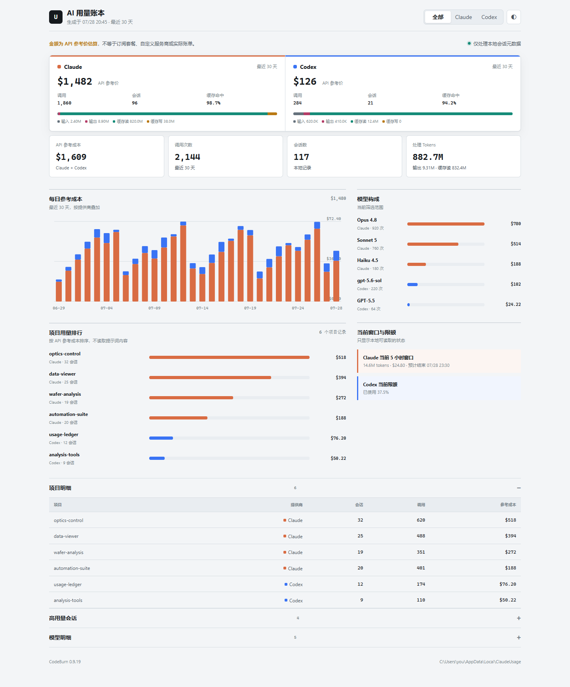
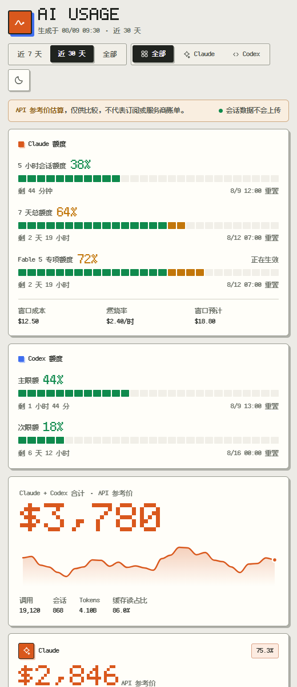

# AI Usage

*[中文说明](README.zh-CN.md)*

Claude Code and OpenAI Codex already leave useful usage metadata on your PC. AI Usage
turns those local records into a one-shot Windows dashboard, so you can see what you
used, when you used it, and how the two tools compare without sending session content
to another service.

It also reads your real Claude plan quota. Cost figures use public API reference prices,
which makes them useful for comparison and trend tracking, but they are not a subscription
invoice or provider bill.



<p align="center"></p>

## What you get

- Claude's real 5-hour and 7-day quota windows, including per-model limits when the
  account returns them.
- Claude and Codex totals in one view, with filters for either provider.
- Last 7 days, last 30 days, and full-history views.
- Smooth daily cost curves, a log-scaled activity calendar, streak counts, and an
  hour-of-day profile.
- Model composition, project ranking, high-usage sessions, and detailed tables.
- A bundled CJK pixel font, light and dark themes, responsive layouts, keyboard-accessible
  charts, and reduced-motion support.

Codex quota windows appear when the provider returns `rate_limits`. Many custom providers
do not return that field; the dashboard says so while keeping local usage and cost views
available.

## Quick start

You need Windows 10 or 11 and Node.js LTS. The installer pins the audited CodeBurn and
ccusage versions, installing or correcting either dependency when needed.

```powershell
git clone https://github.com/AquariusCZ/ccusage-dashboard.git
cd ccusage-dashboard
powershell -ExecutionPolicy Bypass -File .\install.ps1
```

You can also double-click `install.bat`. The installer copies the runtime to
`%LOCALAPPDATA%\ClaudeUsage` and creates an **AI Usage** shortcut on the desktop.
CodeBurn and ccusage are installed as global npm packages and remain installed after
AI Usage is removed. The installer does not change your persistent PowerShell execution
policy.

After that, open **AI Usage** from the desktop whenever you want a fresh snapshot.

## Privacy and network boundary

The session stores used by Claude Code and Codex are read-only inputs. AI Usage removes
prompt text, tool arguments, provider URLs, authorization headers, and `shellCommands`
before it builds the browser payload. Tokens and credentials are never written into the
snapshot or logs.

A normal launch creates temporary `report.html`, `data.js`, and font files. The browser
gets a short window to read them, then the generator deletes them. A small
`%TEMP%\ClaudeUsage\quota-cache.json` remains between runs so a failed quota request can
show the last known percentages and reset times; it contains no token and the uninstaller
deletes it. `-KeepFile` exists only for debugging and writes each retained run into its
own directory.

Two runtime network paths remain, both documented deliberately.

| Purpose | Destination | Data sent |
|---|---|---|
| Read the real Claude plan quota | Anthropic OAuth usage endpoint | The existing Claude Code OAuth token in the authorization header; no session content or usage aggregate |
| Refresh public model prices when CodeBurn's 24-hour cache expires | GitHub raw content | An unauthenticated catalogue request; no credential, session content, or usage aggregate |

The generator rejects unreviewed CodeBurn or ccusage versions, so a global package update
cannot silently widen this boundary.

The OAuth token is read-only. AI Usage does not refresh it, write it back, include it in
errors, or add it to the generated report. A failed quota request never prevents the local
dashboard from rendering.

## How it works

1. The hidden launcher starts `Generate-ClaudeReport.ps1`.
2. CodeBurn normalizes Claude and Codex session metadata and applies public API prices.
3. ccusage supplies the active Claude window's burn rate, projection, and hour profile.
4. The generator trims the result to the aggregates the interface actually renders.
5. The browser loads the local payload, and normal launches clean up the temporary files.

CodeBurn is run one process at a time. Its report command is not concurrency-safe, and
overlapping provider scans can silently mix model and project rows. A per-user Windows
mutex serializes separate dashboard launches as well as the calls within one report.

## Debug snapshot

To keep a report without opening the browser, run:

```powershell
powershell -NoProfile -ExecutionPolicy RemoteSigned -File .\src\Generate-ClaudeReport.ps1 -NoLaunch -KeepFile
```

The command prints the retained `report.html` path. Each run uses a separate
`%TEMP%\ClaudeUsage\debug-<timestamp>-<pid>\` directory, so one debug snapshot cannot
overwrite another.

## Data sources

- [CodeBurn](https://github.com/getagentseal/codeburn) normalizes Claude and Codex
  sessions and applies public API reference prices.
- [ccusage](https://github.com/ccusage/ccusage) supplies active-window burn data and the
  hour-of-day profile.
- Anthropic's OAuth usage endpoint supplies the Claude plan quota.

## Project layout

| Path | Role |
|---|---|
| `src/Generate-ClaudeReport.ps1` | Collects usage and quota data and writes the one-shot snapshot |
| `src/template.html` | Local HTML, CSS, JavaScript, charts, filters, and themes |
| `src/fonts/` | Bundled Ark and Fusion pixel webfonts with OFL-1.1 licenses |
| `src/dashboard.vbs` | Starts the report without opening a console window |
| `install.ps1` | Checks dependencies, installs the runtime, and creates the shortcut |
| `docs/ARCHITECTURE.md` | Data flow, privacy boundary, concurrency notes, and design decisions |

The `%LOCALAPPDATA%\ClaudeUsage` runtime directory, the
`Generate-ClaudeReport.ps1` filename, and the `ai-usage-ledger-theme` preference key are
compatibility identifiers retained from the earlier Claude-only version.

## Uninstall

```powershell
powershell -ExecutionPolicy Bypass -File .\uninstall.ps1
```

When the repository itself lives at `%LOCALAPPDATA%\ClaudeUsage`, the uninstaller removes
only the installed mirror. The Git repository, `src/`, documentation, and history remain.

## Notes for contributors

- Treat `limits[]` as authoritative when deciding whether Claude is blocked. A per-model
  limit can reach 100% while the headline windows still look healthy.
- Keep CodeBurn and ccusage pinned to their audited versions until their runtime behavior
  and network boundary have been checked again.
- Keep `README.md` and `README.zh-CN.md` aligned when behavior changes.
- Render every screenshot in `docs/` from synthetic data. Real paths, project names, and
  quota state are personal data.

## License

[MIT](LICENSE)
